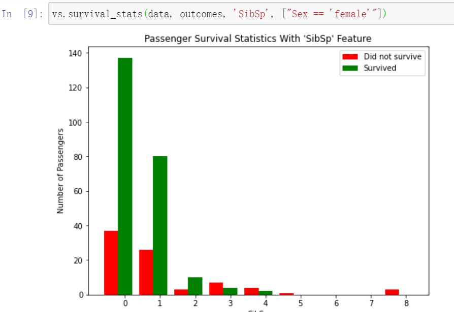
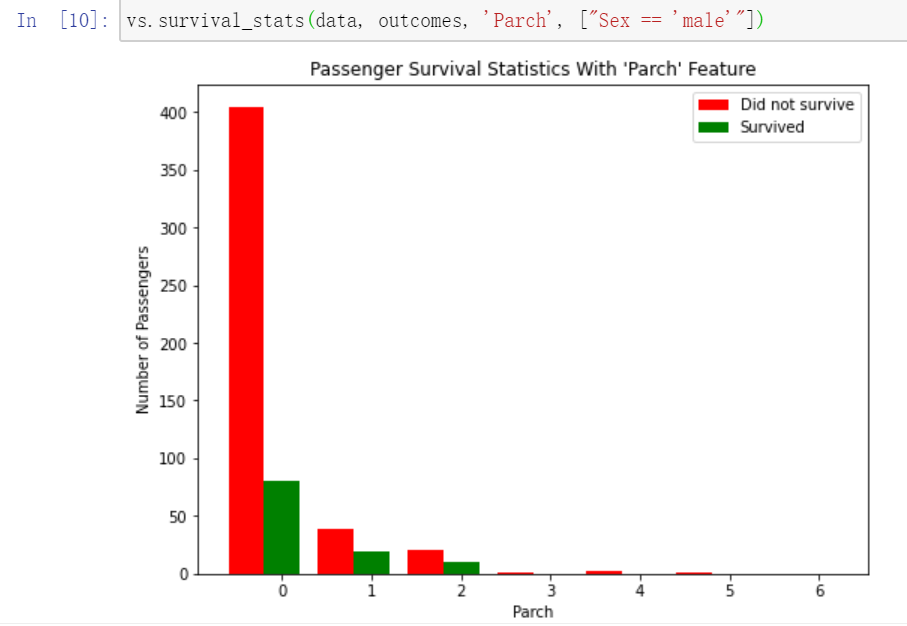
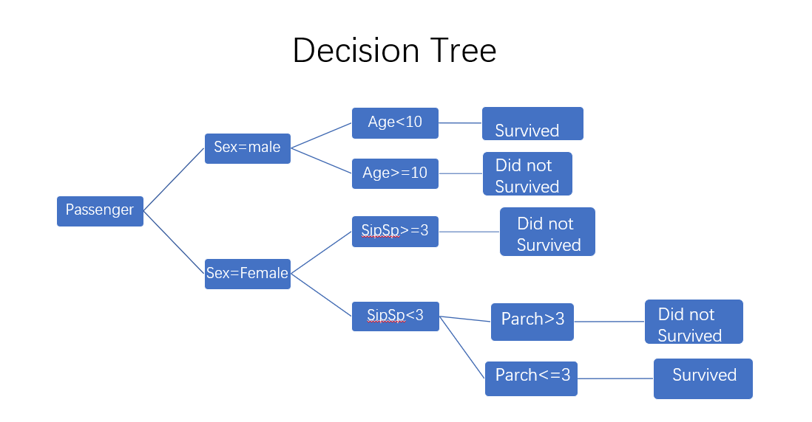
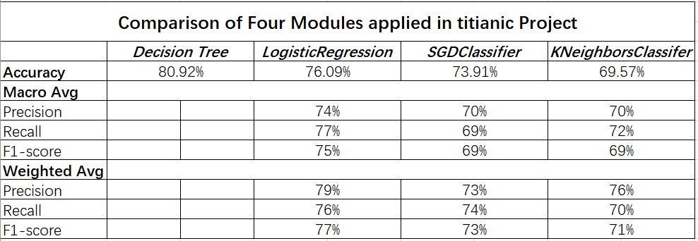

# Machine Learning Engineer Nanodegree
## Introduction and Foundations
## Project: Titanic Survival Exploration

M105120202 林湧
2020/11/02

### Install

This project requires **Python** and the following Python libraries installed:

- [NumPy](http://www.numpy.org/)
- [Pandas](http://pandas.pydata.org)
- [matplotlib](http://matplotlib.org/)
- [scikit-learn](http://scikit-learn.org/stable/)

## Introduction of the project

The backgroud of this project is In 1912, the ship RMS Titanic struck an iceberg on its maiden voyage and sank, resulting in the deaths of most of its passengers and crew. Our project's objective is to figure out which features influnce the prediction wheather someone survived or did not survive. In this project, we will use four simple machine learning model,the decision tree, LogisticRegression, SGDClaiffier & KNN algoritnms to predict the survival situation.To make the prediction more accurate, we test a series of features and conditions to split the data on to obtain an outcome prediction accuracy of at least 80%,and moreover,answer the 5 Questions and 1 Think.

# Method1 Decision Tree

## Think & Questions

***Think***  
Think: Out of the first five passengers, if we predict that all of them survived, what would you expect the accuracy of our predictions to be?
Answer: Three of the first five passengers were survived, so if we predict that all of them survived,the accuracy of our predictions would be 60%.

***Question1***  
Using the RMS Titanic data, how accurate would a prediction be that none of the passengers survived?  
***Answer:***  
By running the code cell below the question,we can see that the predictions have an accuracy of 61.62%, 1.62% higher than the predictions of all survived.

***Question2***  
How accurate would a prediction be that all female passengers survived and the remaining passengers did not survive? 
***Answer:***  
By running the code cell below the question,we can see that the predictions have an accuracy of 78.68%, 17.06% higher than the predictions before.

***Question3***  
How accurate would a prediction be that all female passengers and all male passengers younger than 10 survived?  
***Answer:***  
By running the code cell below the question,we can see that the predictions have an accuracy of 79.35%, just 0.67% higher than the predictions before, a small margin more than with simply using the feature Sex alone.

***Question4***  
Describe the steps you took to implement the final prediction model so that it got an accuracy of at least 80%. What features did you look at? Were certain features more informative than others? Which conditions did you use to split the survival outcomes in the data? How accurate are your predictions?   
***Answer:***   
I tried a series of features combined with mulitple filter conditions before. By putting each condition in the list and then use the list as a parameter to invoke the survival_stats function defined in visuals.py, we can explore the survival statistics visualization to examine various survival statistics.

***Question5***  
Think of a real-world scenario where supervised learning could be applied. What would be the outcome variable that you are trying to predict? Name two features about the data used in this scenario that might be helpful for making the predictions.
***Answer:***  
Outcome variable:whether a city rainny or sunny                                                                     
Features:Pressure,Geographical location,wind belt,occean current and so on.

## My thoughts       
When tring features to explore the survival statistics so that we can improve the accuracy to at least 80%, I found that we should pay attention to the fact showed in the picture which is incompatible with the code. For example, if we list the argument with(data, outcomes, 'SibSp', ["Sex == 'female'"]), we can see that all of the passengers did not survived when the argument 'SibSp' larger than 4. However, the code we typed before is "if passenger['sex'] == 'female  all of them survived". According to this situation, the accuracy will be improved after optimizing the code.

so the code can be optimized like:

    predictions = []
    for _, passenger in data.iterrows():
        if passenger['Sex'] == 'male':
            if passenger['Age'] < 10 :
                predictions.append(1)
            else:
            	if passenger['SibSp'] >= 3:
            		predictions.append(1)
            	else:
               		predictions.append(0)
        else:
            predictions.append(1)
    
     Return our predictions
    return pd.Series(predictions)

As the same way, we can find that the argument "Parch" can also improve the accuracy of the predictions

so the final code that make the accuracy of predictions more than 80% is:

    predictions = []
    for _, passenger in data.iterrows():
        if passenger['Sex'] == 'male':
            if passenger['Age'] < 10 :
                predictions.append(1)
            else:
                predictions.append(0)
        else:
            if passenger['SibSp'] >=3:
                predictions.append(0)
            else:
                if passenger['Parch'] > 3 :
                    predictions.append(0)
                else:
                    predictions.append(1)
    
      Return our predictions
    return pd.Series(predictions)

## Concepts
The technique applied in this project is a manual implementation of a simple machine learning model, the decision tree. The decision tree is a binary tree, which can intuitively describe the logic of the problem. Also, Decision Tree can make the module visiualized more direactly.

# Method 2 & 3 & 4 
# LogisticRegression & SGDClassifier & KNeighborsClassifier

## Introduction
The reason why I use these three methods is that this Titanic Survival Exploration project is an Classification Problem. It means that we should classify whether the passenger we predict is dead or survived. Zero presents dead and 1 presents survived, so the variable is discrete, not linear. 

## Brief of Steps

***step1***  
import the the packages:pandas and numpy, and then load titanic data from the file  
***step2***  
Proprocessing the data, including delete the missing data and replace some columns with values.  
***step3***  
Split the data into 25% for test, and 75% for train.  
***step4***  
Standardize the data and then use these three methods to train the module respectively so that we can use the module to predict the data  
***step5***  
Invoking the score fuctions built-in three methods to get the accuracy of the model by predicting the data.  

## The problems I encountered
When using the logisticRegression, before replacing some columns with values, there is an error occured after invoking the fit function

At first i didnt know how to deal with this problem, but soon I realized that data should be numerical. So I preporcessed the data : 0 presents "male" and 1 presents "female".

data = data.replace(to_replace='male', value=0)
data = data.replace(to_replace='female', value=1)

## The comparison of four modules

As shown in the picture, we can see that the decision tree has the most accuracy prediction among the four modules.However, I believe that it can be more accuracy by optimizing the code continously.  
From the table, we may also draw the conclusion that LogisticRegression has a better Macro Avg and Weight avg among SGDClassifier and KNeighborsClassifier.It has a better Precision(TP/TP+FP), Recall(TP)/(TP+FN) and F1 score, which means that LogisticRegression more accurate to predict the result is survived.  
The KNeighborsClassifier has an accuracy of only 69.57%. Although this Classifier is a simple Nonparametric module, it costs much memory and computation compelexity. In this project, I dont recommand this Classifier.

## My thoughts
*1*   
When preprocessing the data, I dropped many attribute columns which is unnecessary to the prediction. But is there any way to change these information into digits that can make the prediction more accurate? It remains a difficult problem to me.

*2*  
After dropping the passengers which contains invalid data or missing data, we only have 183 passengers' data left. I believe that the four modules expect Decision Tree will be more accurate if we have more valid passenger data.

## Summary           
This project is a kind of Classification problem. we need to use the module to predict wether the passengers survived or dead. To the first method, Decision Tree, I learned how to optimize the code, the algorithmn, to achieve the 80% accuracy. To the last three methods, I learned how to preprocess the data to fit the module's need. And finally from this project, I learned many Classifier modules, and do the compare with these modules. Thanks to professor and my classmates, with their help, I complete the project perfectly
